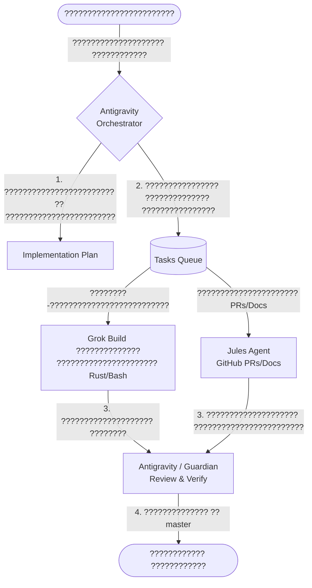

# ?????????????????????? ???? ?????????????????????????? ???????????? Antigravity ?? ?????????????????? ???????????????????? AgentForge

???????????? ???????????????? ???????????????????? ?????????????????????????? ??????????????, ???????????????? ?????????????????????????? ?? ?????????????? ???????????????????????????? ?????? ???????????? **Antigravity** ?? ???????????? ???????????????????????????? AgentForge (Phase 2+).

---

## 1. ???????? ?? ???????????????????????? Antigravity
**Antigravity** ?????????????????? ?? ???????????????? **???????????????? ??????????????????????, ???????????????????????? ?? ????????????????** ?? ???????????????????? AgentForge. ?? ?????????????? ???? ???????????????????????????????????????????? ????????????????????????, Antigravity ???????????????? ?????????????????? ???????????????? ?????????????? ???????? ?? ?????????????????? ??????????????.

### ?????????????????????????? ????????????:
- **Claude 3.5 Sonnet / Claude Opus (Thinking)** ??? ?????? ???????????????????????????????? ????????????????????????????, ?????????????? ????????????, ???????????????????????? ?????????????????????????? ?????????? ?? ?????????????? ?????????????????? ??????????.
- **Gemini 1.5 Pro / 3.1 Pro** ??? ?????? ???????????????????? ???????????????????????? ????????, ???????????? ???????????????????????? ?? ?????????????????? ?????????????????????? ????????????????.

---

## 2. ???????????????? ?????????????????????????? (?????????? ???????????????? Antigravity)
???????????????????? ?????????? ???? `preferred_agent: antigravity` ?????????????????????????? ?? ?????????????????? ??????????????:

1. **?????????????????????????? ???????????????????????? ?? ????????????**:
   - ???????????????? ????????????-????????????????????, ???????????????????????? API, ?????????????????????? ???????????????????? ?? ADR.
   - ???????????????????? ?????????????????? ???????? ???????????? ?? ???????? ???????????????????? (????????????????, ???????????????? Task Store ???? Rust).
2. **???????????????????????? ?? ??????????????????????**:
   - ?????????????????? ?????????????? ?????????????????? ???? ?????????????????? ?????????????????? ?????? Grok ?? Jules.
   - ???????????????????? ???????????????? ?????????? ?? ?????????????????????????? ????????????????.
3. **???????????????????????? ???????????? ???????????????????? (Antigravity Subagents)**:
   - ???????????? ?????????????? ?????????????????????????????????? ?????????? ?????????? `invoke_subagent` ?? ?????????????????????????????? ???????????? (???? 2-5 ???????????????????? ????????????????????????).
4. **?????????????? ???????????????? ??????????????????????**:
   - ??????????????????, ?????????????????????????? ?????????? 5 ???????????? ?????? ?????????????????? ?????????????????? ?????????????????? borrow checker ?? Rust.
5. **Code Review ?? ?????????? ???????????????????????? (Guardian)**:
   - ???????????? ???????????????? ???????? ?????????? ????????????????, ?????????????????????? ???????????????????????? ???????????????? `AGENTS.md` ?? `CODE_MANAGEMENT_PLAN.md`.

---

## 3. ???????????? ???????????????????????????? ?? ?????????????? ???????????????? (Grok & Jules)

???????????? ???????????? ???????????????? ?? ???????????? ????????????, ?????????????????? ???????????? ???? ???????????????? ???????????????????????? ???????????????????????? ??????????????:

### ???????????????? ??????????????????????????:
- **Antigravity ??? Grok**: ???????????????? ???????????? ???? ?????????????????? ????????, ?????????????????????? ?????????????? ?????????? ????????????????????, ?????????????????????? ?????????????? ???????????????????? (sysctl, systemd). Grok ?????????????? ???????????????? ?????? ?????????????? ?? ?????????????????????? ???????????? ?? ???????????????????? worktree.
- **Antigravity ??? Jules**: ???????????? ???? ?????????????????? ???????????????????????????????? ????????????????????????, ???????????????????? ???? ????????????????????????, ???????????????????????? ?????????????????? ?? ???????????????????????? ???????????????? ?????????????? ???? GitHub.
- **Antigravity ??? Antigravity Subagents**: ???????????????????????? ???????????????????? ?????????????????????? ???????????? ???????????????? ?????????? ?? ?????????????????????? ?????????????????????? ???? ?????????????? ????????????.

---

## 4. ?????????????????????????????? ?????????????????? ????????????????????????????
?????? ?????????????????? ?????????????????????????? ???????????? Antigravity ?????????????????? ?????????????????? ??????????????????:
1. **???????????????????????????? ?????????????? ??????????-?????????????????? SSH**: ???? Windows-???????????? ?????????????? SSH-???????????? ?????????????? ????????????????, ???????????????? ????????????????????. ?????????????????? ???????????????????? ???????????????? ?????????????? ???????????? ?????? ??????????????????.
2. **Offline-first ???????????? ?????? Cargo**: ???????????????????? ?????????????????????? ???????????????????????? (`offline = true`) ?????????????????????????? 15-???????????????? ?????????????????? ???????????? ?? ?????????????????????????? ???????????????????? ?????? ?????????????? ?????????????? ?? ???????????????? Rust-????????????????.
3. **???????????????????????? ?????????????????????????? ?? ??????????????????**: ???????????????????????????? ???????????????? ?????????????? ?? ???????????????????? ?? ???????????????? `tasks.db` ?????????? ?????????????? `invoke_subagent` ?????? ???????????? ???????????????????????? ??????????????????.

